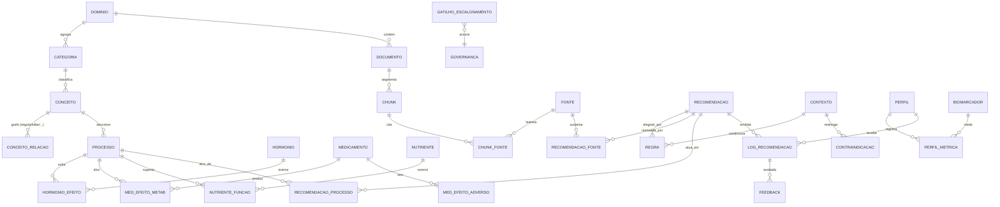

# BodyScan KB — Modelo de dados e base de conhecimento para recomendação por IA Generativa

## Objetivo

Especificar uma base de dados e um modelo de dados para conhecimento de fisiologia humana aplicada ao emagrecimento — perda ponderal acelerada pós-bariátrica, uso de fármacos antiobesidade, queima de gordura, processos cutâneos e adaptação metabólica — estruturados para alimentar um sistema de recomendação baseado em RAG (retrieval-augmented generation) com governança clínica.

O escopo cobre: (1) modelo conceitual e lógico; (2) DDL PostgreSQL + pgvector (`schema.sql`); (3) conhecimento curado de seed (`seed_conhecimento.sql`); (4) referência de ingestão e recuperação (`ingestao_rag.py`).

## Contexto e premissas

| Item | Definição |
|---|---|
| Conhecido | Stack do projeto: Python/FastAPI, Pydantic v2; app BodyScan já calcula IMC, RCQ, RCA, composição corporal. |
| Premissa | A base de conhecimento é serviço próprio (PostgreSQL + pgvector). O banco operacional do app pode permanecer SQLite; integra-se via API. |
| Premissa | O modelo de embeddings define a dimensão do vetor. Padrão adotado: `vector(1536)` (text-embedding-3-small). Ajustável. |
| Premissa | Conteúdo clínico **assiste**, não substitui, decisão profissional. Recomendações com peso clínico exigem `requer_supervisao_medica`. |
| Faltante | Lista oficial de fontes primárias (DOIs/anos) — marcada para verificação; ver seção Referências. |

## Arquitetura técnica

### Componentes

| Camada | Componente | Responsabilidade | Tecnologia |
|---|---|---|---|
| Conhecimento | Núcleo semântico | Conceitos, processos, hormônios, fármacos, nutrientes, contextos | PostgreSQL |
| Vetorial | Chunks + embeddings | Recuperação semântica para RAG | pgvector (HNSW) |
| Recomendação | Recomendações + regras | Mapeia contexto/métrica → orientação com lastro | PostgreSQL + lógica de regras |
| Governança | Evidência, contraindicação, escalonamento | Controle de qualidade clínica e human-in-the-loop | PostgreSQL + camada de aplicação |
| Auditoria | Logs, feedback | Rastreabilidade fim-a-fim de cada saída gerada | PostgreSQL |
| Aplicação | API de recomendação | Orquestra recuperação, regras, LLM e gates | FastAPI |

### Fluxo de dados (recomendação)

1. Entrada: perfil pseudonimizado + contexto clínico + métricas (IMC/RCQ/RCA) do BodyScan.
2. Detecção de gatilho de escalonamento sobre o texto/intenção do usuário (`gatilho_escalonamento`).
3. Se gatilho crítico → bloquear/encaminhar; **não** gerar recomendação autônoma.
4. Recuperação híbrida: filtragem por metadados (`contexto_slugs`, `dominio_slug`, gate de supervisão) + busca vetorial (cosseno) + busca lexical (trigram).
5. Seleção de recomendações elegíveis por `regra_recomendacao` (contexto + `condicao_metrica`).
6. Geração da resposta pela LLM, restrita aos chunks recuperados (grounding) e com citação de fontes.
7. Registro em `log_recomendacao` (chunks usados, modelo, escalonamento) e coleta de `feedback_recomendacao`.

## Modelo conceitual

## Modelo lógico — papel das entidades

| Entidade | Papel | Por que existe |
|---|---|---|
| `dominio_conhecimento`, `categoria` | Taxonomia | Organiza e filtra conhecimento por área (lipídico, pós-bariátrico, pele…). |
| `conceito`, `conceito_relacao` | Grafo semântico leve | Permite raciocínio relacional (ex.: déficit → termogênese adaptativa). |
| `processo_fisiologico` | Mecanismo | Unidade que a recomendação tenta modular (lipólise, colágeno, massa magra). |
| `hormonio` + `hormonio_efeito` | Regulação endócrina | Liga sinalizadores aos processos (insulina inibe lipólise). |
| `medicamento` + efeitos | Farmacologia | GLP-1/GIP e demais; mecanismo, efeitos metabólicos e adversos. |
| `nutriente` + `nutriente_funcao` | Nutrição | Proteína/vit. C/ferro/B12 e função, com flag de relevância pós-bariátrica. |
| `contexto_clinico` | Situação do usuário | Chave de elegibilidade (pós-RYGB, uso de GLP-1, platô, pele redundante). |
| `biomarcador` + `perfil_metrica` | Ponte com BodyScan | IMC/RCQ/RCA e composição como condição de regra. |
| `documento_conhecimento` + `chunk_conhecimento` | RAG | Texto auditável + embedding para recuperação semântica. |
| `recomendacao` + `regra_recomendacao` | Camada de recomendação | Orientações reutilizáveis com força, evidência e regra declarativa. |
| `fonte` + tabelas `_fonte` | Procedência | Rastreabilidade obrigatória de evidência. |
| `contraindicacao`, `gatilho_escalonamento` | Governança | Bloqueio/qualificação e desvio para humano. |
| `log_recomendacao`, `feedback_recomendacao` | Auditoria | Rastreio fim-a-fim e melhoria contínua. |

## Design de RAG e do agente de recomendação

### Estratégia de recuperação
- **Híbrida**: filtragem por metadados (`contexto_slugs`, `dominio_slug`, gate `requer_supervisao_medica`) → busca vetorial cosseno (`<=>`, índice HNSW) → reordenação opcional por trigram (`pg_trgm`) para termos exatos.
- **Gate de governança**: a view `vw_chunk_servivel` exclui conteúdo `nao_verificado` ou que exige supervisão para usos sem profissional.

### Especificação do agente
| Dimensão | Definição |
|---|---|
| Objetivo | Orientar processos de emagrecimento de forma educativa e segura, ancorada em conhecimento curado. |
| Tarefas permitidas | Explicar fisiologia; sugerir categorias de cuidado (proteína, treino de força, hidratação, acompanhamento). |
| Proibições | Prescrever fármaco/dose; emitir metas calóricas/numéricas individuais sem profissional; validar uso off-label; aconselhar perda insegura. |
| Fontes | Apenas chunks recuperados da KB; sem conhecimento livre não ancorado para claims clínicos. |
| Controle de alucinação | Grounding obrigatório + citação de `fonte`; recusar quando a KB não cobrir o tema. |
| Human-in-the-loop | Gatilhos de `gatilho_escalonamento` desviam para profissional/recurso. |
| Métricas | Cobertura de citação, taxa de escalonamento correto, utilidade (`feedback`), ausência de claims sem fonte. |

## Governança clínica e LGPD
- Separar PII: `perfil_usuario` usa `pseudonimo`; consentimento explícito (`consentimento_lgpd`).
- Toda recomendação emitida é auditável (`log_recomendacao`), incluindo chunks e modelo.
- Conteúdo com `requer_supervisao_medica = TRUE` não deve ser servido como ação autônoma.

## Riscos, limitações e dependências

| Risco/limitação | Impacto | Mitigação |
|---|---|---|
| Conteúdo clínico desatualizado/incorreto | Recomendação insegura | `nivel_evidencia` + `requer_verificacao` nas fontes; revisão por profissional. |
| Sinais de transtorno alimentar | Dano ao usuário | `gatilho_escalonamento` bloqueia/encaminha; sem metas numéricas individuais. |
| Uso off-label de GLP-1/GIP | Risco farmacológico | Gatilho específico + recusa de orientação de dose. |
| Embedding incompatível com dimensão | Falha de índice | Padronizar dimensão antes de criar índice (NOTA 1 no `schema.sql`). |
| Fontes não verificadas | Evidência frágil | Bloqueio de uso clínico até verificação; ver Referências. |
| Generalização para indivíduo | Recomendação inadequada | Regras por contexto + métrica; disclaimer e supervisão. |

## Referências

Instituições reais aplicáveis (a verificar edição/ano/DOI antes de uso em produção):

- American Society for Metabolic and Bariatric Surgery (ASMBS) / AACE / TOS — diretrizes perioperatórias de suporte nutricional/metabólico em cirurgia bariátrica.
- World Health Organization (WHO) — classificação de IMC.
- Endocrine Society — diretriz de manejo farmacológico da obesidade.
- American Diabetes Association (ADA) — Standards of Care, capítulo de obesidade.

> Referência requerida: validar com literatura revisada por pares, documentação oficial ou fonte institucional antes da publicação clínica.

Termos de busca sugeridos:
- "ASMBS nutritional metabolic support bariatric surgery guideline"
- "GLP-1 GIP receptor agonist obesity efficacy lean mass"
- "waist-to-height ratio cardiometabolic risk systematic review"
- "skin retraction massive weight loss collagen elastin"

## Próximas ações recomendadas
1. **Validar fontes primárias** e preencher `fonte.doi/ano`, removendo `requer_verificacao` apenas após revisão clínica.
2. **Definir o modelo de embedding** e fixar a dimensão do vetor em todo o esquema antes de ingerir em escala.
3. **Implementar o pipeline** `ingestao_rag.py` (chunking + embeddings) e popular `chunk_conhecimento.embedding`.
4. **Revisão clínica** das recomendações e gatilhos por nutricionista/médico antes de exposição a usuários.
